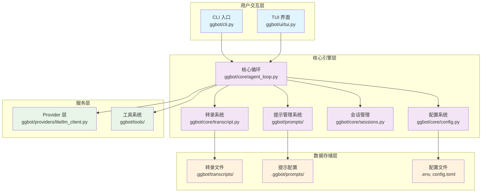
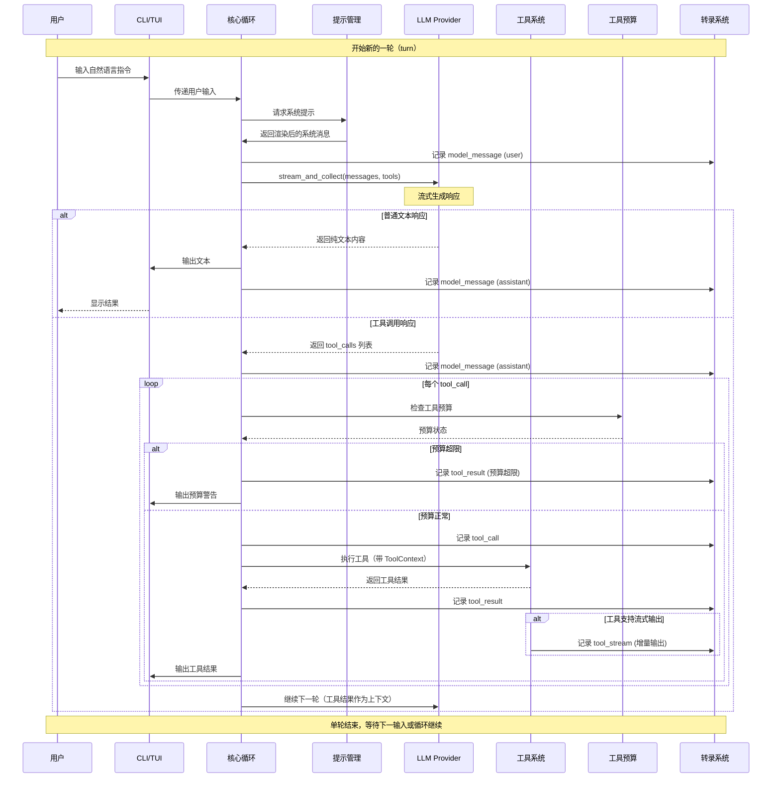
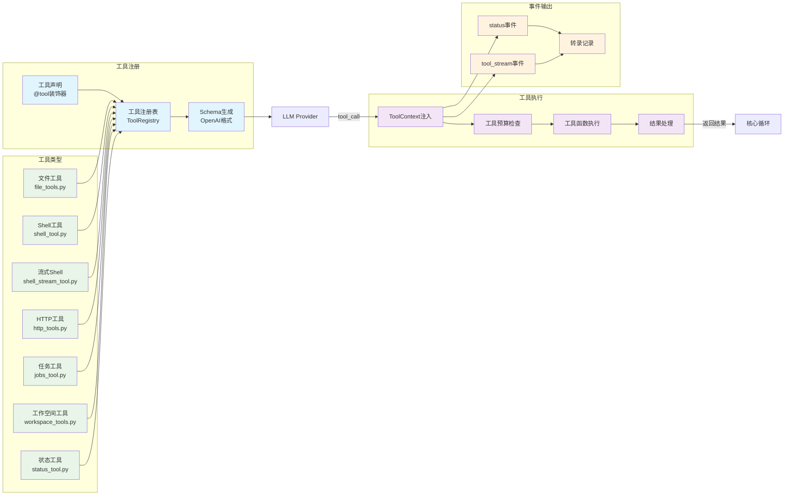

# 架构（Architecture）

**文档分级：A（只给项目成员｜内部）**

## 总览

GGbot 是一个最小化的 CLI/TUI Agent：
- 输入：用户自然语言
- 输出：模型文本 + 工具调用（tool calls）
- 关键保证：
  - 工具只能在 workspace_root 沙箱内读写（见 `ggbot/core/permissions.py`）
  - transcript 使用 JSONL 事件流落盘，可复盘/恢复（见 `ggbot/core/transcript.py`）
  - query loop 保证 tool_call/tool_result 的时序合法，并提供自动修复（见 `ggbot/core/agent_loop.py`）
  - 工具调用预算防止重复/失控调用（见 `ggbot/core/agent_loop.py` ToolLimits）

## 模块分层

### CLI 入口：`ggbot/cli.py`
- 注册内置工具（文件、shell、HTTP、任务、工作空间、状态等）
- 创建 transcript/session
- 初始化 PromptManager 构建系统提示
- 调用 query loop（run_query）

### 核心循环：`ggbot/core/agent_loop.py`
- 维护 messages 列表（OpenAI-style chat messages）
- 调用 provider client（LiteLLMClient）进行流式生成
- 解析工具调用并执行工具
- 工具预算限制（max_tool_calls, max_tool_calls_per_tool, max_tool_calls_same_args）
- 记录事件到 transcript（tool_call/tool_result/status/tool_stream/provider_error…）

### 提示管理系统：`ggbot/prompts/`
- **`manager.py`**: PromptManager - 统一管理提示配置
- **`repository.py`**: PromptRepository - 加载提示配置（默认层 + 自定义配置）
- **`builder.py`**: PromptBuilder - 根据上下文渲染提示模板
- **`types.py`**: 数据类型定义（PromptContext, PromptLayer, PromptProfile, RenderedPrompt）
- 支持多模式（chat/repl/tui）和动态工具列表集成

### Provider（LLM 调用）：`ggbot/providers/litellm_client.py`
- 通过 LiteLLM 统一适配多家 provider（OpenAI, Anthropic, Azure, 等）
- 产出 assistant final：content + tool_calls
- 错误统一包装为 `ProviderError`
- **`client_factory.py`**: 工厂函数创建 LLM 客户端

### 工具系统：`ggbot/tools/`
- **`registry.py`**: 工具注册/Schema 导出/执行
- **`context.py`**: ToolContext 注入（用于工具向 transcript 发事件）
- **核心工具模块**:
  - `file_tools.py`: 文件读写操作
  - `shell_tool.py`: 安全执行 Shell 命令（需确认）
  - `shell_stream_tool.py`: 流式 Shell 命令执行
  - `http_tools.py`: HTTP 请求工具
  - `jobs_tool.py`: 后台任务管理
  - `workspace_tools.py`: 工作空间管理
  - `status_tool.py`: 状态更新工具

### 配置系统：`ggbot/core/config.py`
- 统一配置管理（环境变量 > .env > TOML > 默认值）
- 新增提示配置：`prompt_profile`, `prompt_dir`
- 工具安全配置：`max_tool_calls`, `max_tool_calls_per_tool`, `max_tool_calls_same_args`
- 工作空间和转录目录配置

### 会话与持久化：`ggbot/core/sessions.py`、`ggbot/core/session_meta.py`
- session id 与元信息
- 与 transcript 文件的映射

### UI 层：`ggbot/ui/`
- **`tui.py`**: 文本用户界面（基于 Textual）
- **`pets.py`**: ASCII 艺术/动画渲染

## 架构框图



## 数据流（一次 turn）

1) **用户输入处理**：
   - 用户输入追加到 messages
   - 写入 transcript：`type=model_message`

2) **系统提示构建**：
   - 根据当前模式（chat/repl/tui）和可用工具列表
   - 通过 PromptManager 构建系统消息
   - 替换模板变量：`{mode}`, `{workspace_root}`, `{tool_list}`

3) **LLM 调用**：
   - 调用 provider：`client.stream_and_collect(messages, tools=registry.openai_tools())`
   - provider 流式输出文本：可通过 `on_text_delta` 打印到 CLI/TUI
   - provider 返回 tool_calls：写入 transcript（assistant 的 model_message）

4) **工具执行与预算检查**：
   - 对每个 tool_call 检查工具预算限制
   - 记录 `type=tool_call` 事件
   - 执行工具（带 ToolContext 注入）
   - 追加 tool message 到 messages（role=tool, tool_call_id=...）
   - 记录 `type=tool_result` 事件
   - 如果工具支持流式输出，记录 `type=tool_stream` 事件

5) **循环控制**：
   - 若 assistant 没有 tool_calls：本轮结束
   - 若达到 max_turns 或工具预算超限：结束循环

## 数据流时序图



## Transcript 事件类型（常用）

- `model_message`: 所有 chat message（system/user/assistant/tool）
- `tool_call`: 工具调用（解析后的 arguments + 原始 arguments）
- `tool_result`: 工具返回（长度、是否 error、是否 auto_healed 等）
- `tool_stream`: 工具执行过程中的增量输出（例如 `shell_stream`）
- `status`: 工具/运行时状态更新（例如 `status_update`）
- `provider_error`: provider 调用失败/异常

CLI 可用：`ggbot log --follow --events` 实时查看这些事件。

## Transport 协议边界（WebSocket/HTTP）

为支持未来 React CLI/Web UI 或远程客户端，核心层新增了稳定的 transport 事件信封（见 `ggbot/core/transport_protocol.py`）。

- 协议版本：`version=1`
- 事件序号：`seq`（单连接/单会话内单调递增）
- 会话标识：`session_id`
- 时间戳：`ts_ms`
- 事件来源：`source`（如 `agent_runtime` / `query_loop`）
- 事件类型：`event_type`（复用 runtime/transcript 事件类型）
- 负载：`data`（事件 payload）

这样做的目的：
- 核心 query loop 不依赖传输层（WebSocket/HTTP/stdio）
- 适配层只需消费统一 envelope，而不是直接耦合内部对象
- 前后端可以通过 `version` 做兼容协商，降低二次开发破坏风险

当前状态：
- 已提供 runtime events -> transport envelopes 的编码器
- 已提供 NDJSON 序列化与反序列化校验
- 具体 WebSocket/HTTP Server 仍可作为下一步适配层实现

## 工具约定

### Schema

当前工具 schema 输出为 OpenAI tool schema（`ToolSpec.as_openai_tool()`）。
注意：这只是 schema 形式；provider 侧实际通过 LiteLLM 适配。

### ToolContext 注入

工具函数可以声明两种签名：
- `def tool_name(args: ArgsModel) -> str`
- `def tool_name(ctx: ToolContext, args: ArgsModel) -> str`

当声明了 `ctx: ToolContext`，运行时会注入上下文，可用于：
- `ctx.emit("status", {...})`: 写 status 事件
- `ctx.emit("tool_stream", {...})`: 写 tool_stream 事件

### 工具预算（防失控）

`ToolLimits` 配置（可通过环境变量设置）：
- `max_tool_calls`: 单轮最大工具调用总数（默认 30）
- `max_tool_calls_per_tool`: 单个工具最大调用次数（默认 12）
- `max_tool_calls_same_args`: 相同参数的最大调用次数（默认 3）

用于阻止模型在 tool_calls 上进入"重复调用同一工具/同参"的死循环。

## 工具系统架构



## 提示系统架构

### 配置层级
```
默认层 (代码中定义)
  ↓
配置文件层 (.ggbot/prompts/{profile}.md) [可选]
  ↓
最终渲染的系统提示
```

### 默认提示层
1. **role**: 角色定义（"You are GGbot, a pragmatic coding agent..."）
2. **workflow**: 工作流信息（模式、工作空间根目录）
3. **tooling**: 可用工具列表
4. **safety**: 安全约束（不访问工作空间外路径，危险操作需确认）

### 自定义配置
用户可在 `.ggbot/prompts/{profile}.md` 中添加自定义提示层，会追加到默认层之后。

## 配置加载优先级

1. **真实环境变量**（最高优先级）
2. **Dotenv 文件**: `./.env`、`./.ggbot/.env`
3. **TOML 配置**: `./.ggbot/config.toml`
4. **默认值**（最低优先级）

环境变量始终优先，适合敏感信息（API keys）。配置文件适合项目共享配置。

## 兼容性注意

- 多数 OpenAI-compatible provider 要求：assistant 的 tool_calls 必须紧跟对应的 tool messages。
- `agent_loop` 内置两段修复逻辑：
  - 自动补齐缺失的 tool messages（auto-heal）
  - 孤儿 tool messages 转 system（sanitize）

改动 query loop 或 transcript 格式时，必须保证：
- 恢复逻辑仍能读旧 JSONL
- tool_call/tool_result 的顺序不被破坏

## 扩展点

### 添加新工具
1. 在 `ggbot/tools/` 创建新工具模块
2. 定义 Pydantic 输入模型和工具函数
3. 使用 `@tool` 装饰器注册
4. 在 `cli.py` 中导入并添加到工具注册表

### 添加新 Provider
1. 实现 `ggbot/providers/types.py` 中的 `ChatCompletionClient` 接口
2. 在 `client_factory.py` 中添加创建逻辑
3. 更新配置支持新的 provider 参数

### 自定义提示配置
1. 在 `.ggbot/prompts/` 创建 `{profile}.md` 文件
2. 设置环境变量 `GGBOT_PROMPT_PROFILE={profile}`
3. 系统会自动加载自定义提示层

## 测试策略

- 单元测试：`tests/` 目录
- 工具测试：验证工具函数正确性
- 集成测试：验证 query loop 和 transcript 兼容性
- 配置文件测试：验证配置加载优先级