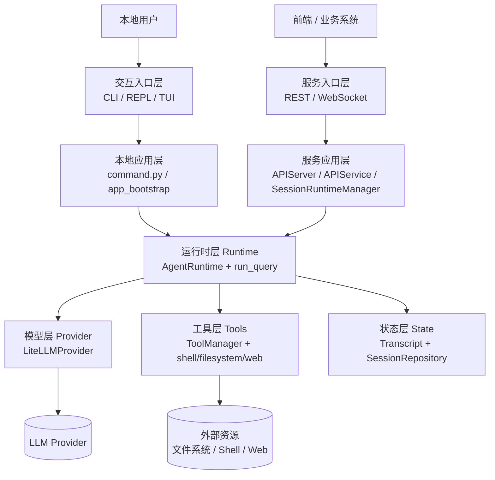
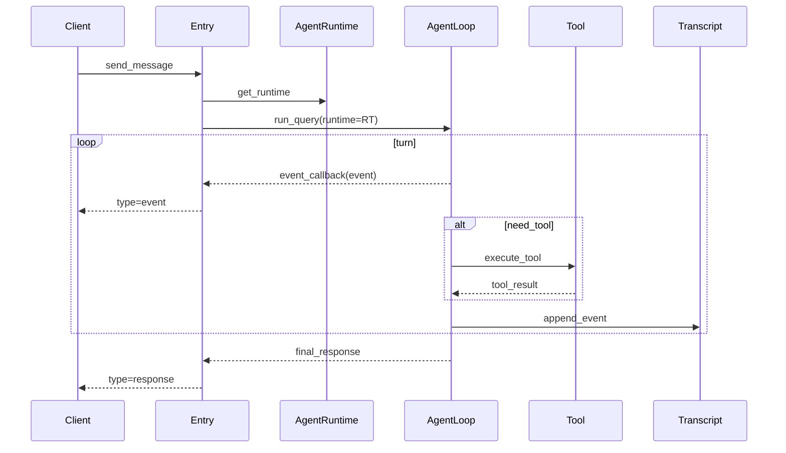
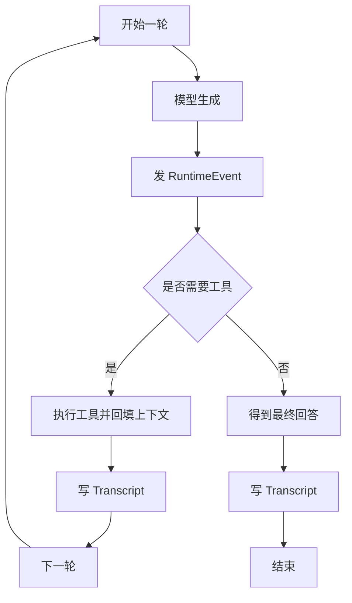
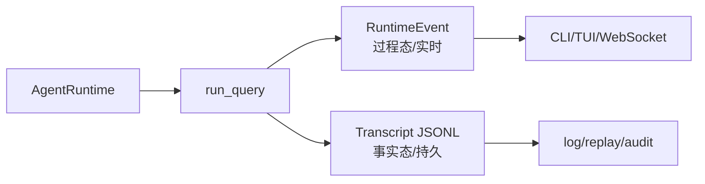
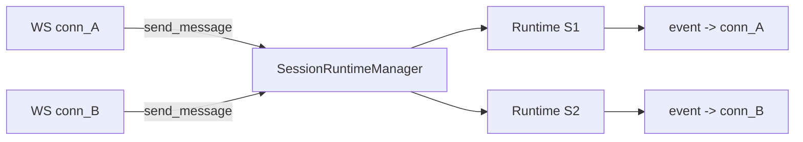

# GGbot 架构总览

文档分级：A（只给项目成员｜内部）

## 1. 一句话架构

GGbot 采用单主链路设计：

- 执行核心：`AgentRuntime`
- 过程信号：`RuntimeEvent`（通过 `event_callback` 实时输出）
- 持久事实：`Transcript`（JSONL）

这样可以同时满足实时交互（UI/API）和可追溯审计（log/replay）。

## 2. 分层结构（看一眼就懂）

每层职责：

- 交互入口层：本地终端交互（CLI/REPL/TUI），不承载服务协议逻辑
- 服务入口层：REST/WS 协议接入、连接管理、命令分发
- 应用层：分别处理本地会话初始化与 API 会话管理，随后汇入同一 runtime 主链
- 运行时层：执行一轮/多轮 Agent 推理与工具调用
- 模型层：负责模型流式输出、工具调用协议适配
- 工具层：封装外部能力
- 状态层：会话事实落地与回放

## 3. 主流程（`send_message`）

主流程只要记住 Client 会收到两类数据：

- `type=event`：过程实时事件
- `type=response`：最终结果

一句话记忆：`AgentRuntime` 管执行，`RuntimeEvent` 管过程可见，`Transcript` 管事实留痕。

### 3.1 AgentLoop 内部（细节图）

说明：

- 主流程图只讲“入口到返回”，不展开内部实现细节。
- 细节图只保留循环骨架：模型 -> 事件 ->（可选工具）-> 落盘 -> 下一轮/结束。

## 4. AgentRuntime / Event / Transcript 关系

### 4.1 `AgentRuntime`：执行容器

`AgentRuntime` 聚合本次会话执行所需依赖：

- `provider`
- `tool_manager`
- `transcript`
- `settings`

它的定位是“可执行上下文”，不是“协议对象”也不是“数据库对象”。  
`run_query()` 基本不直接依赖入口层（CLI/API）细节，而是围绕 `AgentRuntime` 工作，这就是多入口可复用的根本原因。

### 4.2 `RuntimeEvent`：过程通道

`run_query()` 中的关键节点（模型增量、工具调用、状态变更、错误）都会转成 `RuntimeEvent`。

用途：

- 前端实时渲染（TUI / Web）
- API 流式输出
- 调试观察（recent events）

关键理解：`RuntimeEvent` 是“过程信号”，强调实时性和可观测，不承诺长期存储格式稳定。

### 4.3 `Transcript`：事实通道

`Transcript` 按会话写入 JSONL，记录用户消息、助手消息、工具调用结果等“可回放事实”。

用途：

- 追踪“真实发生过什么”
- 会话恢复与重放
- 审计与排障

关键理解：`Transcript` 是“事实账本”，是最终回放与审计依据。

### 4.4 两条通道的分工

设计意义：

- 过程快：事件随时发，UI 不阻塞
- 事实稳：transcript 作为最终依据
- 解耦强：UI 改版不影响落地格式，存储改造不影响实时渲染

## 5. API 多会话与隔离

API 模式由 `SessionRuntimeManager` 管理会话上下文：

- 每个 `session_id` 独立 runtime 状态
- 会话级锁控制并发写入
- WebSocket 实时事件按连接投递，不做全连接广播

## 6. 为什么这套设计“巧妙”

- 单主链：避免 legacy 双轨并行导致的维护分叉
- 强可观测：事件用于实时，transcript 用于事实，各司其职
- 易扩展：新 UI 只需消费 `RuntimeEvent`，新存储只需适配 transcript 层
- 易排障：线上问题可用“recent events + transcript”双视角快速定位
