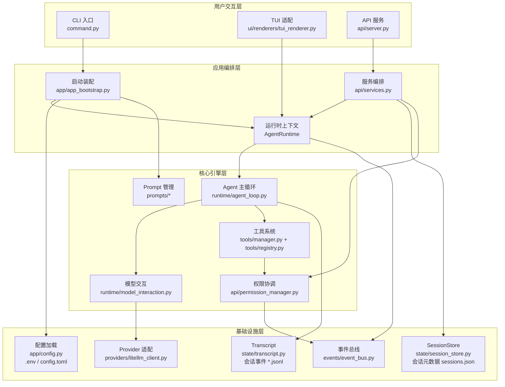
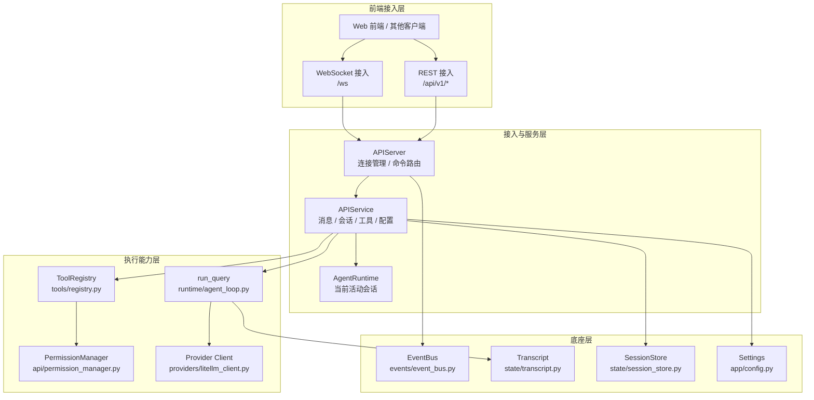
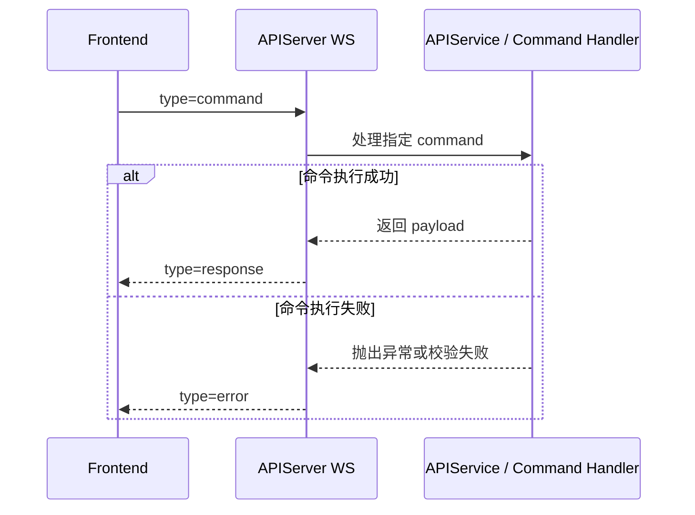
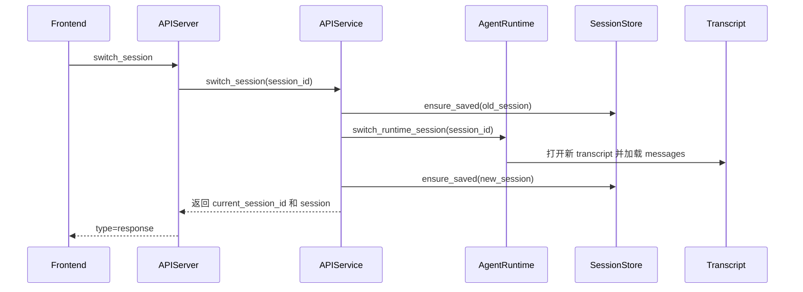

# 架构（Architecture）


文档分级：A（只给项目成员｜内部）


## 文档目的

本文档描述   当前仓库已落地实现  （非目标态），用于：

- 新成员快速建立系统心智模型
- 评估改动影响范围（API / runtime / tools / transcript）
- 统一安全、性能、重构讨论语义

相关文档：

- 安全现状与风险：`doc/security.md`
- 认证与传输分层计划：`doc/user_auth_and_transport_split_plan.md`
- 当前问题清单：`doc/当前问题.md`

## 事实基线（避免路径误判）

- 仓库根目录：`<repo>/`
- Python 包实际根目录：`<repo>/ggbot/`
- 本文中如写 `api/server.py`，默认指 `ggbot/api/server.py`

## 当前目录与职责（以代码为准）

```text
ggbot/
  __main__.py                    # python -m ggbot 入口
  command.py                     # Typer CLI 入口（chat/repl/tui/log/api）

  app/
    config.py                    # 配置加载（env/.env/toml）
    app_bootstrap.py             # AppSession / AgentRuntime 创建与会话切换
    client_factory.py            # LLM client 工厂

  api/
    server.py                    # FastAPI + WS 路由、连接管理、命令分发
    services.py                  # 会话、消息、工具、配置、权限响应等服务
    permission_manager.py        # shell 权限请求/响应协调（阻塞等待）

  runtime/
    agent_loop.py                # run_query 主循环（turn + tool budget）
    model_interaction.py         # provider 流式交互、thinking/plan 解析
    tool_execution.py            # 工具调用、tool_call/tool_result 事件落盘
    history_repair.py            # tool message 历史修复

  state/
    transcript.py                # transcript 读写、open_session、消息回放
    session_store.py             # sessions.json 元数据
    sessions.py                  # 默认会话发现（chat/repl/tui）
    session_meta.py              # 会话元信息模型

  events/
    event_bus.py                 # 全局事件总线（发布/订阅）
    runtime_events.py            # runtime event 构造与消费分发
    event_mappings.py            # domain event -> transcript event 映射
    transcript_logger.py         # 订阅 event_bus 并写 transcript
    event_handlers/*             # 事件处理器（TUI/监控适配）

  tools/
    manager.py                   # 内置工具装配
    registry.py                  # 工具注册、schema、调用入口
    context.py                   # ToolContext（session/transcript/workspace）
    file_tools.py / shell_*.py / http_tools.py / web.py / jobs_tool.py ...

  providers/
    litellm_client.py            # LLM provider 适配
    types.py                     # ChatCompletionClient 协议

  prompts/
    manager.py / builder.py / repository.py / types.py

  transport/
    transcript_contract.py       # transcript 事件契约
    transport_protocol.py        # envelope 编解码（当前 API 未全面接入）

  ui/
    renderers/tui_renderer.py    # TUI 事件渲染适配

  workspace/
    permissions.py               # 工作区路径约束
    workspace_manager.py
```

## 系统架构框图（真实实现）



> 为保证图面清晰，`history_repair.py`、`transcript_logger.py`、`ToolContext` 等辅助模块未单独展开，保留在文字说明中。

## API 模式逻辑框图（当前）



## 启动与运行路径

### 1) CLI 模式

1. `python -m ggbot` -> `ggbot/__main__.py` -> `command.app()`
2. `chat/repl` 通过 `create_app_session()` + `create_agent_bootstrap()` 初始化运行时
3. 调用 `run_query()` 执行一轮对话
4. transcript 直接由 runtime 写入；CLI 通过返回事件做终端渲染

### 2) API 模式（当前前后端主链路）

1. `ggbot api --host --port` 进入 `command.py:api`
2. 创建 `AgentRuntime` 后启动 `run_api_server()`
3. `api/server.py` 暴露 REST + WS；消息主链路是 WS `send_message`
4. `api/services.py` 调用 `run_query`、`registry.call`、`session_store`
5. 事件通过 WS 回推客户端，transcript 同步落盘

> 注意：`/api/v1/messages` 和 `/api/v1/permissions/respond` 在 `server.py` 中已标注弃用并注释保留，当前建议统一走 WS 命令。

## 核心对象关系

### AgentRuntime（`app/app_bootstrap.py`）

`AgentRuntime` 持有核心可变状态：

- `session_id`
- `transcript`
- `messages`
- `registry`
- `client`
- `system_message`

`switch_runtime_session()` 会替换 `session_id/transcript/messages`，是当前会话切换基础。

### APIService（`api/services.py`）

服务层能力：

- 会话列表/创建/查询/更新/删除/切换
- `send_message`（线程池中调用 `run_query`）
- `execute_tool`（线程池中调用 `registry.call`）
- `respond_permission`（对接 `PermissionManager.resolve`）
- 配置查询与更新、最近事件缓冲查询

### PermissionManager（`api/permission_manager.py`）

- `request()`：创建待审批请求并阻塞等待
- `resolve()`：校验连接/会话归属后唤醒等待方
- 通过全局 `event_bus` 发布 `permission_request/permission_response`

## 信令流图（时序）

### 1) WS 消息类型与生命周期



### 2) 单轮对话（含工具调用）信令

```mermaid
sequenceDiagram
    participant FE as Frontend
    participant WS as APIServer
    participant SVC as APIService
    participant LOOP as run_query
    participant MODEL as perform_model_turn
    participant TOOL as ToolRegistry
    participant TS as Transcript

    FE->>WS: send_message
    WS->>SVC: send_message
    SVC->>LOOP: 启动 run_query
    LOOP->>TS: 记录 user message
    LOOP->>MODEL: 执行模型轮次
    MODEL-->>LOOP: 输出 delta 或 tool_calls
    LOOP-->>SVC: 产生 runtime event
    SVC-->>WS: event_callback
    WS-->>FE: type=event

    alt 触发工具调用
        LOOP->>TS: 记录 tool_call
        LOOP->>TOOL: 执行工具
        TOOL-->>LOOP: 返回结果
        LOOP->>TS: 记录 tool_result
        LOOP-->>SVC: 产生 tool event
        SVC-->>WS: event_callback
        WS-->>FE: type=event
    end

    LOOP->>TS: 记录 assistant message 和 turn_complete
    LOOP-->>SVC: 返回 QueryResult
    SVC-->>WS: 返回 final payload
    WS-->>FE: type=response
```

### 3) Shell 权限审批信令（API 模式）

```mermaid
sequenceDiagram
    participant LOOP as shell_run tool
    participant PM as PermissionManager
    participant BUS as EventBus
    participant WS as APIServer
    participant FE as Frontend

    LOOP->>PM: 发起审批请求
    PM->>BUS: 发布 permission_request
    BUS-->>WS: 通知 WS 连接
    WS-->>FE: 推送审批事件
    FE->>WS: 提交审批结果
    WS->>PM: 调用 resolve
    PM-->>LOOP: 唤醒等待中的请求线程
    LOOP->>PM: request() 结束等待
    PM->>BUS: 发布 permission_response
    PM-->>LOOP: 返回允许或拒绝
    BUS-->>WS: 通知审批结果
    WS-->>FE: 推送审批结果事件
```

### 4) 会话切换信令（API 模式）



## 事件与持久化模型（当前真实路径）

### A. 对话执行事件（主链路）

- 来源：`run_query` / `perform_model_turn` / `execute_tool_call`
- 形态：函数内构造 `RuntimeEvent`，通过 `event_callback` 传给 APIService/WS
- 持久化：runtime 直接 `transcript.append(...)`，不是先发 event bus 再落盘

### B. 全局事件总线事件（辅助链路）

- 来源：`permission_manager`、部分 `ui/event_handlers`
- 形态：`publish_event(...)` 到 `events/event_bus.py`
- 消费：WS 订阅转发、`TranscriptLogger` 订阅并写入 transcript

### Transcript（事实源）

持久化文件：

- 会话事件：`<transcript_dir>/<session_id>.jsonl`
- 元数据：`<transcript_dir>/sessions.json`（由 `SessionStore` 维护）

常见 transcript 事件类型：

- `model_message`
- `tool_call`
- `tool_result`
- `thinking`
- `turn_info` / `turn_update` / `turn_complete`
- `status`
- `provider_error`

## 工具系统

- `tools/manager.py` 负责创建并注册内置工具
- `tools/registry.py` 提供工具 schema 与统一调用入口
- `ToolContext` 注入 `session_id/transcript/workspace_root`
- 工具预算由 `runtime/agent_loop.py` 中 `ToolLimits` + `_ToolBudgetState` 控制
- `shell_run` 在 API 模式默认通过 `shell_confirm_callback` 接入权限审批流程

## 传输协议层（现状）

`transport/transport_protocol.py` 已定义标准 envelope：

- `version`
- `session_id`
- `seq`
- `ts_ms`
- `source`
- `event_type`
- `data`

但当前 `api/server.py` 的 WS 推送仍使用自定义结构（`type/event_type/data/timestamp/source`），尚未全量切换到 envelope。

## 当前架构约束（必须知晓）

以下是当前实现事实，不是目标态：

- API 模式使用全局 `runtime/APIService`，仍是单进程共享可变状态
- WS 默认订阅全局事件总线，同时 `send_message` 也会绑定连接级回调，存在双通道并存
- 消息主链路已转 WS；部分旧 HTTP 端点以注释形式保留
- 认证授权尚未完整闭环（当前主要覆盖 shell 权限审批）
- `ui/` 目前核心是事件渲染适配，不是完整多端 UI 子系统

## 演进方向（与现状兼容）

1. 先补齐认证与事件隔离（安全优先）
2. 将 runtime/service 从全局可变状态拆到连接级/用户级上下文
3. 统一 WS/HTTP 输出到 transport envelope
4. 再推进 UI/transport 插件化扩展

***

维护约定：

- 本文件只记录已落地实现
- 目标态设计请放独立计划文档，不与本文件混写
